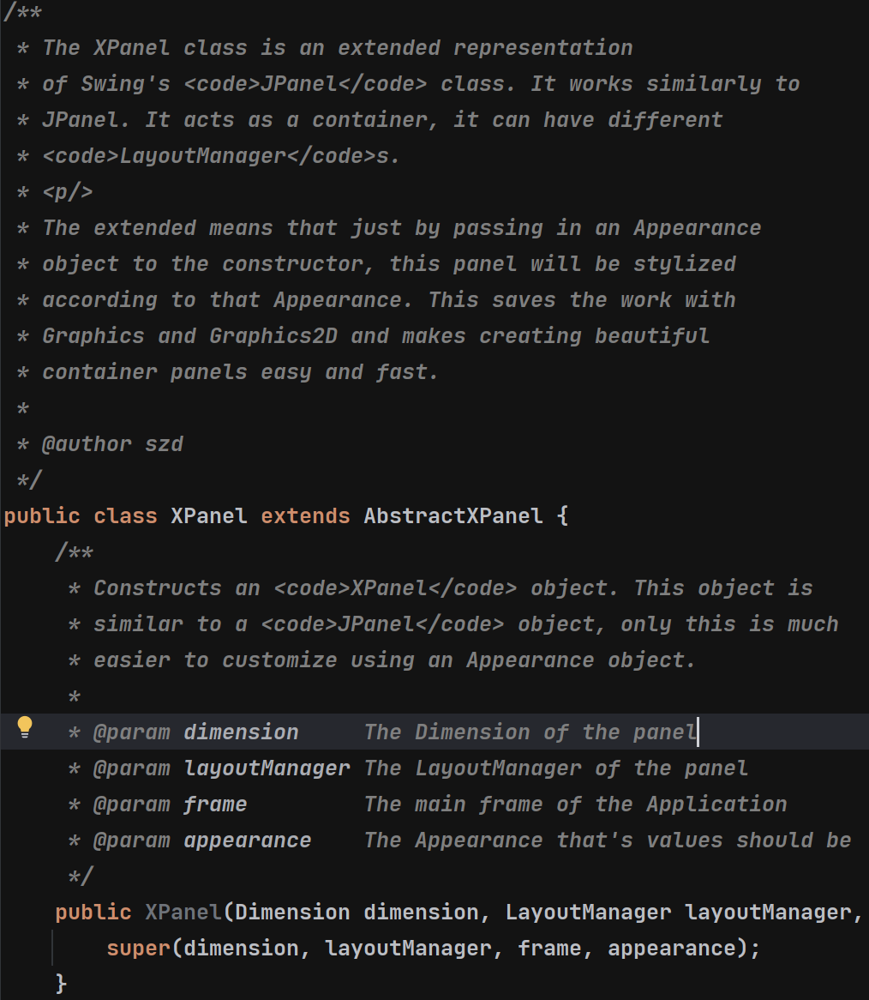
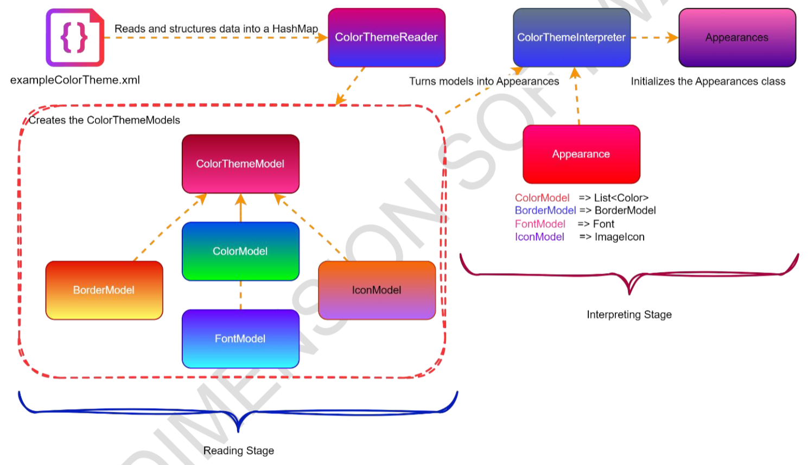

# Documentation

Documentation is important, and it must be well done in order to
avoid conflicts and misunderstandings.

**The followings should be taken into consideration:**

> 1. Non-abstract classes, interfaces, enums should all have docstrings defined
>      above them. Constructors should be documented too.
> 
> 2. Complex methods, or methods that are visible outside the class should
>      be documented using docstrings above them.
> 
> 3. Inside a method, complex steps or abbreviated variables should be described.
> 
> 4. Design Documents **must** be written for larger pack of codes that make up
>      a whole unit of the application.

*Example for docstrings*

*Example for a design document*
