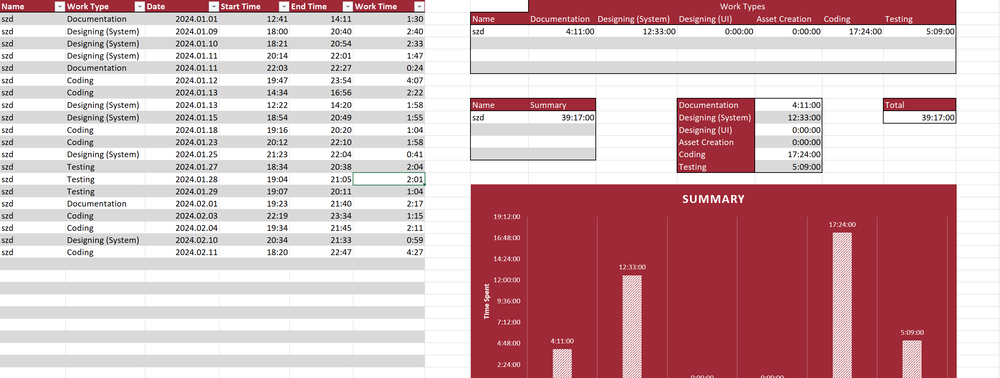
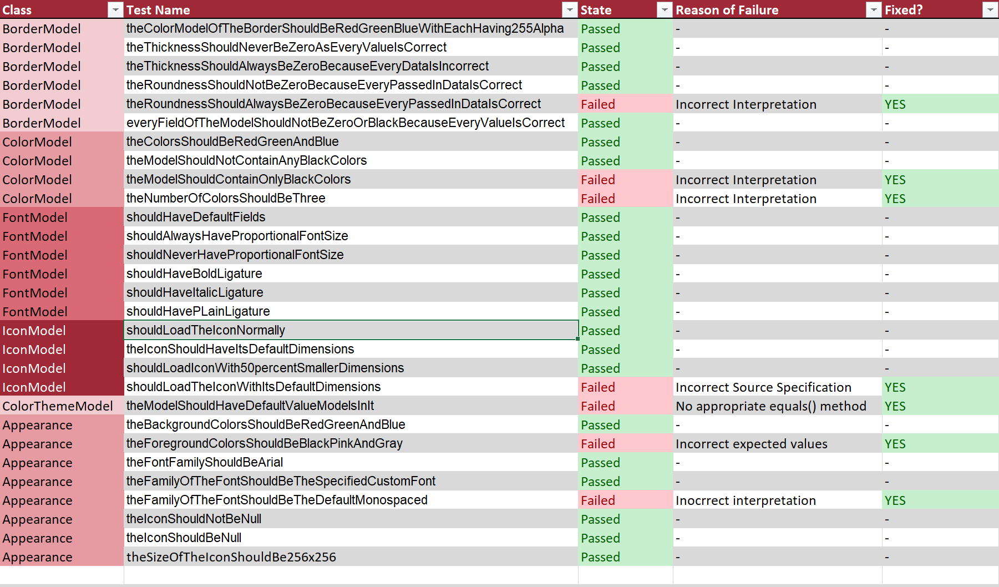

# Log Writing

Logs are very important parts of the development process as they can be used to trace the origin of an error or create a statement about the distribution of the work between developers.

**When writing a log, the followings should be taken into consideration:**

> 1. Log files must have a uniform structure
> 
> 2. Logs must be precisely written (time, developer, work done)
> 
> 3. For every individual aspect of the development, individual logs must be created
> 
> 4. Logs should have sections that show data based on a filter
> 
> 5. Logs should have diagrams about results and stored data

*Example for work log*

*Example for other type of log (test log)*
