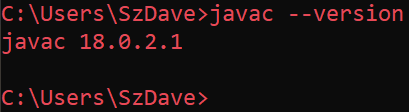
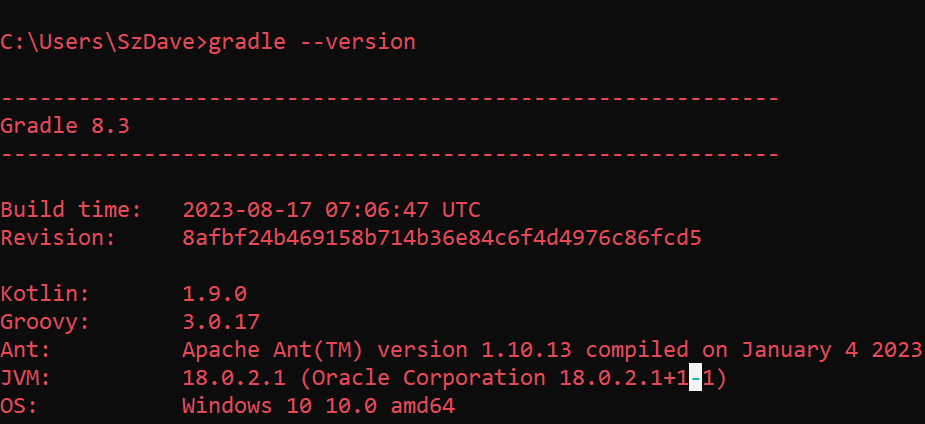
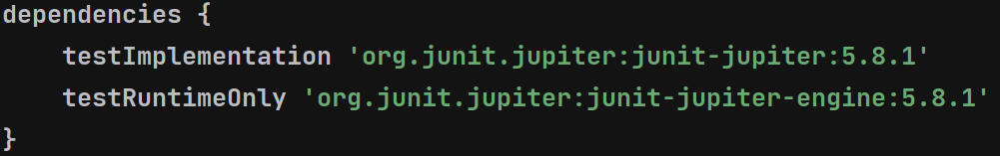

# Requirements

These are the requirements that must be fulfilled in order to be able to work on the project.

**Please make sure to double-check that every version, build number and software is correct in order to avoid conflicts!**

| Tool                | Name    | Version  |
|:------------------- |:-------:|:--------:|
| Language            | Java    | 18.0.2.1 |
| Build Tool          | Gradle  | 8.3      |
| Build Tool Language | Groovy  | 3.0.17   |
| Build Tool JVM      | -       | 18.0.2.1 |
| Unit Test Framework | JUnit 5 | 5.8.1    |

*Java version*

*Gradle version*

*JUnit version*
